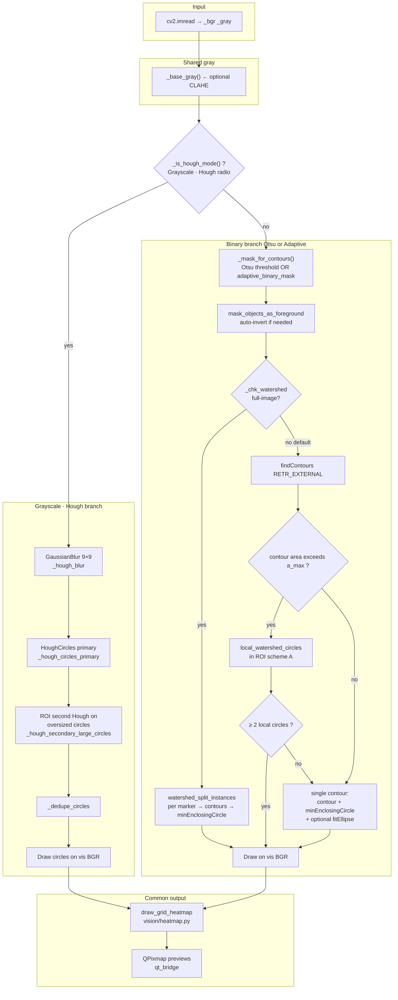
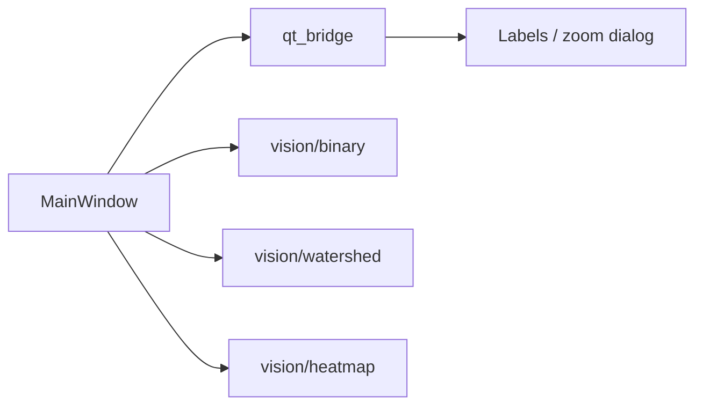

# Image Recognize

**[简体中文项目介绍](README.zh.md)**

Desktop application for **detecting circular objects** in images (e.g. microscopy, blood smears) and visualizing **spatial density** with an **m×n heatmap**. The UI is built with **PyQt6**; image processing uses **OpenCV** and **NumPy**. There is **no** web backend or database—everything runs locally in one window.

---

## What it does

1. **Open an image** (common raster formats via OpenCV).
2. **Preview four synchronized views**:
   - **Original** color image.
   - **Processed** view: global **Otsu** binary, **adaptive** local binary, or **9×9 Gaussian-blurred grayscale** (matching the input to the Hough path).
   - **Contours & fit**: detected circles drawn on the original (and optional contours / ellipses depending on options).
   - **Heatmap**: the image area split into an **m×n** grid; each cell is colored **blue → red** by how many detected circles intersect that cell, with a numeric color bar.
3. **Adjust heatmap grid** with spin boxes **m** (rows) and **n** (columns).
4. **Click any preview** to open a scrollable zoom window.

Default UI language is **English**; use the language button to switch to **Chinese**.

---

## Detection modes (logic always available; part of the UI may be hidden)

- **Binary · Adaptive** — Local adaptive threshold (after light blur); then `findContours`, optional **scheme A** (local watershed inside oversized blobs only), or **full-image watershed** when enabled.
- **Binary · Otsu** — Single global threshold from Otsu; same contour / watershed pipeline as adaptive.
- **Grayscale · Hough** — No binary mask: **HoughCircles** on blurred grayscale, plus a **second Hough pass** on ROIs around unusually large circles, then deduplication.

Optional toggles (when visible in the UI): **CLAHE** on grayscale, **full-image watershed** (disables scheme A), **circles-only** drawing (hide colored contours and ellipses).

---

## Architecture

### System overview

- **Single-process desktop app**: one `QMainWindow`, no HTTP server, no database.
- **Split package layout**: runnable entry at repo root (`main.py`); reusable code under **`imrec/`** (importable Python package).
- **Separation of concerns**: **OpenCV / NumPy** routines live under `imrec/vision/` and **do not import Qt**. The UI layer calls them and converts arrays for display via **`imrec/qt_bridge.py`**.
- **Orchestration**: most application state and the full detection **pipeline** live in **`MainWindow`** (`imrec/ui/main_window.py`)—it wires user actions to preview updates and heatmap refresh. This favors a small-tool workflow over a strict MVC split.

### User options that shape the pipeline

These controls live on `MainWindow` (some may be in a **hidden** panel in your build). They are read inside `_refresh_result_view()` and `_contour_and_fit()`.

| Option | Type | What it does |
|--------|------|----------------|
| **Binary · Adaptive** | Radio (exclusive) | Builds mask with `adaptive_binary_mask()` on `_base_gray()`; then **binary branch** below. |
| **Binary · Otsu** | Radio | Global `cv2.threshold(..., OTSU)` on `_base_gray()`; same **binary branch**. |
| **Grayscale · Hough** | Radio | Skips binary mask entirely; **Hough branch** on blurred grayscale. |
| **CLAHE** | Checkbox | When on, `_base_gray()` applies CLAHE before any threshold, mask, or Hough input. |
| **Full-image watershed** | Checkbox | **Binary branch only.** Runs `watershed_split_instances` on the whole mask and fits circles per instance. **When on, scheme A (local watershed on large blobs) is not used.** |
| **Circles only** | Checkbox | Drawing style only: hide orange contours and cyan ellipses; circles drawn black or green. |
| **Heatmap m, n** | Spin boxes | After circles are known, `draw_grid_heatmap` partitions the **fit preview** size; changing m/n recomputes heatmap from cached detections. |
| **Language** | Button | UI strings only; does not change algorithms. |

### Pipeline: grayscale (Hough) vs binary (contours)

Entry point: **`_contour_and_fit()`** in [`imrec/ui/main_window.py`](imrec/ui/main_window.py).  
Parallel **preview** of the middle pane: **`_refresh_result_view()`** shows Otsu / adaptive / 9×9 blur consistent with the selected mode (it does not run detection by itself).



**Binary branch details (scheme A, default):** `findContours` → for each contour above `min_area`, if area **>** `a_max` (derived from median area), the code tries **local watershed** inside that blob’s ROI; if it yields **at least two** circles, those are used; otherwise the contour is treated as one object (min enclosing circle, optional ellipse when not “circles only”).

### Logical layers

| Layer | Role | Primary code |
|------|------|----------------|
| **Bootstrap** | Build `QApplication`, show `MainWindow` | [`imrec/app.py`](imrec/app.py), [`main.py`](main.py) |
| **Presentation** | Widgets, layouts, file dialog, language toggle, zoom dialog | [`imrec/ui/`](imrec/ui/) |
| **Orchestration** | Mode radios, checkboxes, `_base_gray`, branch choice, call vision, cache detections | [`imrec/ui/main_window.py`](imrec/ui/main_window.py) |
| **Display bridge** | `ndarray` → `QPixmap`, rich-text snippets for status | [`imrec/qt_bridge.py`](imrec/qt_bridge.py) |
| **Vision (headless)** | `adaptive_binary_mask`, `mask_objects_as_foreground`, watershed helpers, heatmap | [`imrec/vision/`](imrec/vision/) |
| **Config & i18n** | Constants, zh/en strings | [`imrec/config.py`](imrec/config.py), [`imrec/i18n.py`](imrec/i18n.py) |



### Runtime data flow

1. **Load**: `cv2.imread` → **`_bgr`**, **`_gray`**; original pane shows a downscaled `QPixmap`.
2. **Processed pane**: `_refresh_result_view()` mirrors the **selected mode** (Otsu / adaptive binary / 9×9 blur for Hough) into **`_last_result_array`** for display.
3. **Detection**: `_contour_and_fit()` follows the **Hough** or **binary** branch above → **`_last_vis_fit`**, **`_last_detected`**, **`_last_status_core`**.
4. **Heatmap**: `_apply_heatmap_panel()` uses **m, n** and **`draw_grid_heatmap`** → **`_last_heat`**; changing **m/n** recomputes from cached circles when available.
5. **Zoom**: arrays → **`ImageZoomDialog`** → **`numpy_bgr_to_qpixmap`**.

All heavy work runs on the **Qt GUI thread** (no `QThread` worker in the current design).

### UI structure

- **Central layout**: vertical box—parameters row (open file, **m**, **n**, language), optional **hidden panel** (`_advanced_options_panel`) holding mode radios, CLAHE / watershed / circles-only checkboxes, and the rich-text status area—then a **2×2 grid** of scroll areas for the four previews.
- **Titles**: per-cell captions (e.g. original / processed / contours & fit / heatmap) come from **`UI_STR`** via `_t()`.

### Package map (`imrec/`)

| Path | Purpose |
|------|---------|
| [`imrec/vision/binary.py`](imrec/vision/binary.py) | Adaptive threshold helper, mask polarity (`mask_objects_as_foreground`) |
| [`imrec/vision/watershed.py`](imrec/vision/watershed.py) | Full-image watershed markers; **scheme A** local watershed inside ROI |
| [`imrec/vision/heatmap.py`](imrec/vision/heatmap.py) | Grid/circle intersection counts, blue→red coloring, color bar drawing |
| [`imrec/ui/widgets.py`](imrec/ui/widgets.py) | `ClickableLabel` (`clicked` signal) |
| [`imrec/ui/dialogs.py`](imrec/ui/dialogs.py) | `ImageZoomDialog` |
| [`imrec/ui/main_window.py`](imrec/ui/main_window.py) | Full window build + detection pipeline methods |
| [`imrec/ui/__init__.py`](imrec/ui/__init__.py) | Lazy export of `MainWindow` to avoid import cycles |

---

## Requirements

- **Python 3.10+** (3.13 used in development)
- Dependencies in [`requirements.txt`](requirements.txt): `PyQt6`, `opencv-python-headless`, `numpy`

---

## Installation

```bash
cd /path/to/image_recognize
python3 -m venv .venv
source .venv/bin/activate          # Windows: .venv\Scripts\activate
pip install -r requirements.txt
```

On macOS/Linux systems with **PEP 668** (externally managed Python), install into a virtual environment as above instead of using `pip` on the system interpreter.

---

## Run

```bash
python main.py
# or
python -m imrec
```

Run these from the **project root** so the `imrec` package resolves correctly.

---

## Quick file index

| Path | Purpose |
|------|---------|
| [`main.py`](main.py) | Entry point; calls `imrec.app.run()` |
| [`imrec/__main__.py`](imrec/__main__.py) | Enables `python -m imrec` |
| [`imrec/app.py`](imrec/app.py) | Starts `QApplication` and `MainWindow` |

*(See **Architecture → Package map** for the rest of `imrec/`.)*

---

## Heatmap rules

- Counts use **circle–rectangle intersection** (disk vs axis-aligned cell).
- Color scale is **per image**: minimum count → blue, maximum → red (linear in BGR; mid tones skew purple). If all cells share the same count, the map is solid blue.

---

## Additional documentation

[`SOLUTION_AND_ARCHITECTURE.md`](SOLUTION_AND_ARCHITECTURE.md) (Chinese) goes deeper on **algorithm concepts** for stakeholders—Gaussian blur vs Otsu vs adaptive threshold, CLAHE, watershed trade-offs, and presentation talking points. This README’s **Architecture** section covers **software structure**; that document focuses on **CV theory and wording**, not duplicate layout tables.

---

## License

No `LICENSE` file is included yet; add one if you redistribute the project.
