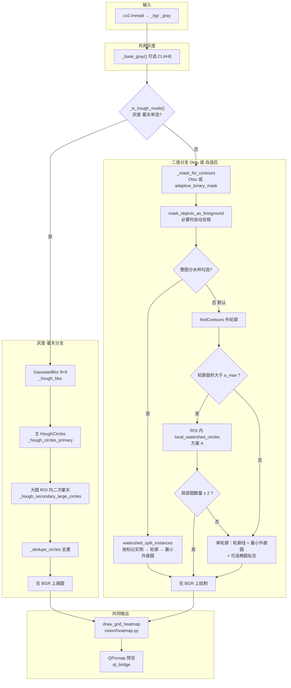
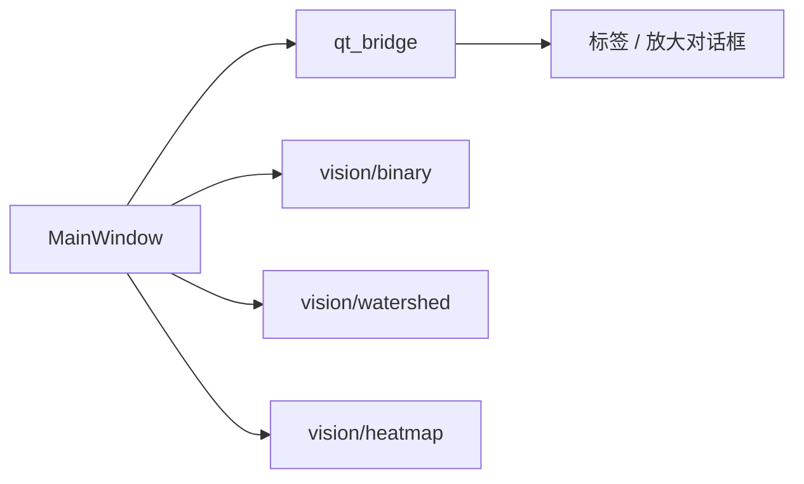

# 图像识别（Image Recognize）

**[English project overview](README.md)**

面向显微、血涂片等场景的**桌面小工具**：在图像上做**圆形目标检测**，并用 **m×n 网格热力图**展示圆在平面上的**疏密分布**。界面使用 **PyQt6**，图像算法使用 **OpenCV** 与 **NumPy**。**无** Web 服务、**无**数据库，单机单窗口运行。

---

## 功能概览

1. **打开图片**（OpenCV 支持的常见位图格式）。
2. **四宫格联动预览**：
   - **原图**：彩色原稿。
   - **处理结果**：随模式切换为 **Otsu 全局二值**、**自适应局部二值**，或 **9×9 高斯模糊灰度**（与灰度·霍夫路径的输入一致）。
   - **轮廓与拟合**：在原图叠加识别到的圆（以及可选的轮廓线、椭圆等，取决于选项）。
   - **热力图**：将画面划为 **m 行 × n 列** 网格，按每个格子与圆盘是否**相交**计数；**蓝→红**映射本图最小～最大计数，右侧附色标与刻度。
3. **参数**：**m**（行）、**n**（列）由数字框调节，改后按当前识别结果重算热力图。
4. **单击**任意预览格可弹出**可滚动放大**窗口。

界面默认 **英文**，可用语言按钮切换为 **中文**。

---

## 识别模式说明（逻辑保留；部分界面可能隐藏）

- **二值·自适应**：灰度经轻模糊后做**自适应阈值**得到掩膜 → `findContours`；默认 **方案 A** 仅对**过大连通域**在 ROI 内做**局部分水岭**拆圆；若开启**整图分水岭**则改为全图一次分水岭流程（与方案 A 互斥）。
- **二值·Otsu**：**全局 Otsu** 二值掩膜，后续与自适应路径相同。
- **灰度·霍夫**：**不做二值掩膜**，在模糊灰度上 **HoughCircles**，对**异常大圆**在 ROI 内**二次霍夫**，再**去重**。

可选（界面可见时）：**CLAHE** 预处理灰度；**整图分水岭**；**仅显示识别圆**（黑线圆，隐藏彩色轮廓与椭圆）。

---

## 架构说明

### 系统形态

- **单机桌面应用**：单个 `QMainWindow`，无 HTTP 服务、无数据库。
- **包结构**：仓库根目录 [`main.py`](main.py) 负责启动；可复用代码集中在 **`imrec/`** 包内，便于 `import` 与测试。
- **职责划分**：**OpenCV / NumPy** 相关逻辑放在 **`imrec/vision/`**，**不依赖 Qt**。界面通过 **`imrec/qt_bridge.py`** 把 `ndarray` 转成 `QPixmap` 等再显示。
- **编排中心**：应用状态与完整识别**流水线**主要由 **`MainWindow`**（[`imrec/ui/main_window.py`](imrec/ui/main_window.py)）串联——用户操作、预览刷新、热力图更新均在此协调。定位为**小工具式**结构，而非严格 MVC。

### 影响流水线的用户选项

以下控件在 `MainWindow` 上（部分构建里可能在**隐藏面板**）。由 `_refresh_result_view()`、`_contour_and_fit()` 读取。

| 选项 | 类型 | 作用 |
|------|------|------|
| **二值·自适应** | 单选（三选一） | 在 `_base_gray()` 上 `adaptive_binary_mask()` 得掩膜 → 走下方**二值分支**。 |
| **二值·Otsu** | 单选 | 在 `_base_gray()` 上全局 Otsu 阈值得掩膜 → 同一套**二值分支**。 |
| **灰度·霍夫** | 单选 | **不做二值掩膜** → 走 **霍夫分支**（模糊灰度上霍夫圆）。 |
| **CLAHE** | 勾选 | 开启时 `_base_gray()` 先 CLAHE，再参与阈值/掩膜/霍夫。 |
| **整图分水岭** | 勾选 | **仅二值分支**。全图 `watershed_split_instances` 后按实例拟合圆。**勾选后不再走方案 A（大团局部分水岭）**。 |
| **仅显示识别圆** | 勾选 | 仅影响绘制：隐藏橙轮廓与青椭圆，圆为黑/绿。 |
| **热力图 m、n** | 数字框 | 在已有圆列表后，`draw_grid_heatmap` 按拟合图尺寸划格；改 m/n 用缓存圆重算热力图。 |
| **语言** | 按钮 | 仅界面文案，不改变算法。 |

### 流水线：灰度霍夫 vs 二值轮廓

入口：**`_contour_and_fit()`**（[`imrec/ui/main_window.py`](imrec/ui/main_window.py)）。  
中间「处理结果」预览：**`_refresh_result_view()`** 单独刷新，与当前模式一致（Otsu / 自适应二值 / 9×9 模糊），**不单独跑识别**。



**二值分支（默认、未勾整图分水岭）：** `findContours` → 对每个超过 `min_area` 的轮廓，若面积 **大于** `a_max`（由面积中位数等推导），先尝试 **ROI 局部分水岭**；若得到 **至少两个** 圆则用它们；否则按**单个轮廓**处理（最小外接圆，非「仅圆」时可拟合椭圆）。

### 逻辑分层

| 层次 | 职责 | 主要代码 |
|------|------|----------|
| **启动** | 创建 `QApplication`、显示主窗口 | [`imrec/app.py`](imrec/app.py)、[`main.py`](main.py) |
| **表现层** | 控件、布局、打开文件、语言切换、放大对话框 | [`imrec/ui/`](imrec/ui/) |
| **编排** | 模式单选、勾选、`_base_gray`、分支选择、调用 vision、缓存检测列表 | [`imrec/ui/main_window.py`](imrec/ui/main_window.py) |
| **显示桥接** | `ndarray` → `QPixmap`、状态区富文本 | [`imrec/qt_bridge.py`](imrec/qt_bridge.py) |
| **视觉算法（无 Qt）** | `adaptive_binary_mask`、`mask_objects_as_foreground`、分水岭、热力图 | [`imrec/vision/`](imrec/vision/) |
| **配置与文案** | 常量、中英 `UI_STR` | [`imrec/config.py`](imrec/config.py)、[`imrec/i18n.py`](imrec/i18n.py) |



### 运行时数据流

1. **载入**：`cv2.imread` → **`_bgr`**、**`_gray`**；原图区显示缩放 `QPixmap`。
2. **处理结果区**：`_refresh_result_view()` 按**当前模式**刷新 Otsu / 自适应 / 9×9 模糊预览 → **`_last_result_array`**。
3. **识别**：`_contour_and_fit()` 走 **霍夫** 或 **二值** 分支 → **`_last_vis_fit`**、**`_last_detected`**、**`_last_status_core`**。
4. **热力图**：`_apply_heatmap_panel()` 用 **m、n** 与 **`draw_grid_heatmap`** → **`_last_heat`**；改 **m/n** 时在已有缓存下重算热力图。
5. **放大**：数组 → **`ImageZoomDialog`** → **`numpy_bgr_to_qpixmap`**。

图像计算均在 **Qt 主线程**（当前未使用 `QThread`）。

### 界面结构

- **中央区**：纵向布局——参数行（打开图片、**m**、**n**、语言）；其下可有**隐藏面板**（`_advanced_options_panel`：模式单选、CLAHE/分水岭/仅圆等勾选及识别结果富文本）；再下为 **2×2 四宫格**滚动预览。
- **标题与提示**：各格标题、工具提示来自 **`UI_STR`**，经 `_t()` 按当前语言切换。

### 包内文件一览（`imrec/`）

| 路径 | 作用 |
|------|------|
| [`imrec/vision/binary.py`](imrec/vision/binary.py) | 自适应二值辅助、掩膜极性校正（`mask_objects_as_foreground`） |
| [`imrec/vision/watershed.py`](imrec/vision/watershed.py) | 整图分水岭标记；**方案 A** 在 ROI 内的局部分水岭 |
| [`imrec/vision/heatmap.py`](imrec/vision/heatmap.py) | 格与圆相交计数、蓝→红着色、右侧色标条绘制 |
| [`imrec/ui/widgets.py`](imrec/ui/widgets.py) | `ClickableLabel`（单击 `clicked` 信号） |
| [`imrec/ui/dialogs.py`](imrec/ui/dialogs.py) | `ImageZoomDialog` |
| [`imrec/ui/main_window.py`](imrec/ui/main_window.py) | 主窗口搭建 + 完整识别流程方法 |
| [`imrec/ui/__init__.py`](imrec/ui/__init__.py) | 懒加载导出 `MainWindow`，避免循环导入 |

---

## 环境依赖

- **Python 3.10+**（开发环境曾用 3.13）
- 见 [`requirements.txt`](requirements.txt)：`PyQt6`、`opencv-python-headless`、`numpy`

---

## 安装

```bash
cd /path/to/image_recognize
python3 -m venv .venv
source .venv/bin/activate          # Windows: .venv\Scripts\activate
pip install -r requirements.txt
```

若系统 Python 受 **PEP 668** 限制，请勿全局 `pip install`，请在虚拟环境中安装。

---

## 运行

```bash
python main.py
# 或
python -m imrec
```

请在**项目根目录**执行，以便正确解析 `imrec` 包。

---

## 快速索引

| 路径 | 作用 |
|------|------|
| [`main.py`](main.py) | 入口，调用 `imrec.app.run()` |
| [`imrec/__main__.py`](imrec/__main__.py) | 支持 `python -m imrec` |
| [`imrec/app.py`](imrec/app.py) | 创建 `QApplication` 与主窗口 |

*其余 `imrec/` 下文件见上文 **包内文件一览**。*

---

## 热力图规则

- 判定为**圆盘与轴对齐矩形格子是否相交**。
- **色标按当前图各格计数的最小值～最大值**自动拉伸：少→蓝，多→红（BGR 线性插值，中间偏紫）。无圆或全格相同计数时表现为**单色蓝**。

---

## 其他文档

**[`SOLUTION_AND_ARCHITECTURE.md`](SOLUTION_AND_ARCHITECTURE.md)** 为**中文**材料，侧重**算法概念与汇报话术**（高斯模糊、Otsu、自适应、CLAHE、分水岭取舍等）。本文 **架构说明** 描述的是**软件分层与数据流**；该文档侧重**计算机视觉原理与对外表述**，与上文目录表**互补而非重复**。

---

## 许可证

仓库尚未包含 `LICENSE`；若对外分发请自行补充。
